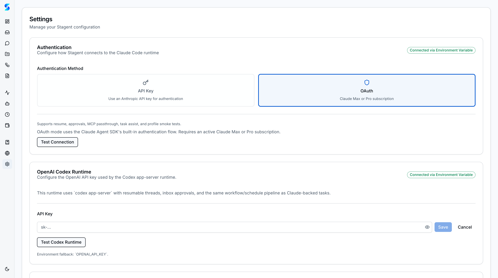

# Developer Guide

You are a developer who wants to understand what is happening under the hood. You care about runtime configuration, tool permission models, the architecture that connects your prompts to agent execution, and how to extend the system when the built-in capabilities are not enough. This guide takes you through the technical setup of Stagent's dual-runtime architecture, the permission system that governs agent behavior, the monitoring layer that gives you full visibility, and the development workflow for contributing to Stagent itself.

## Prerequisites

- **Node.js 18 or later** installed
- An **Anthropic API key** or Claude Max subscription
- Optionally, an **OpenAI API key** for the Codex runtime
- Familiarity with terminal/CLI workflows and TypeScript
- About 20 minutes

## Journey Steps

### Step 1 — Install and Run from the CLI
*Estimated time: 2 minutes*

Stagent is distributed as an npm package. No cloning, no Docker, no infrastructure.

```bash
npx stagent
```

This command does several things in sequence:

1. Downloads and caches the Stagent package
2. Starts a Next.js server (Turbopack-accelerated in development)
3. Initializes a SQLite database at `~/.stagent/stagent.db` with WAL mode enabled
4. Creates the upload directory at `~/.stagent/uploads/`
5. Opens your browser to `http://localhost:3000`

The database is self-healing — `CREATE TABLE IF NOT EXISTS` runs at startup for all critical tables, so you never need to manually run migrations. If you are working from a cloned repository, use `npm run dev` instead for hot reloading.

> **Tip**: The database uses WAL (Write-Ahead Logging) mode, which allows concurrent reads during writes. This matters when multiple agent tasks are executing simultaneously and writing logs.

---

### Step 2 — Configure Claude Authentication
*Estimated time: 2 minutes*

Stagent supports two authentication methods for the Claude runtime. Navigate to **Settings** in the sidebar.



**OAuth (recommended for Claude Max subscribers)**:
- Select the **OAuth** radio button
- Click **Test Connection** to verify
- OAuth routes through your Claude Max subscription with no per-token billing

**API Key**:
- Select the **API Key** radio button
- Enter your Anthropic API key (or set `ANTHROPIC_API_KEY` in `.env.local`)
- Click **Test Connection** to verify
- API key usage is metered and billed per token

The default authentication method is OAuth. An important architectural detail: when Stagent spawns agent subprocesses, it strips the `ANTHROPIC_API_KEY` from the environment to prevent OAuth agents from accidentally falling back to API key billing. This isolation is intentional.

> **Tip**: For CI/CD or headless deployments, API key authentication is more practical since OAuth requires an interactive browser session for the initial handshake.

---

### Step 3 — Set Up the OpenAI Codex Runtime
*Estimated time: 2 minutes*

Stagent supports a second runtime: OpenAI Codex, accessed through the Codex App Server.

In **Settings**, find the OpenAI Codex configuration section:

1. Enter your OpenAI API key
2. Click **Test Connection** to verify the Codex App Server is reachable
3. The connection uses WebSocket JSON-RPC under the hood (see `src/lib/agents/runtime/codex-app-server-client.ts`)

With both runtimes configured, you can assign different providers to different tasks or workflow steps. This is powerful for cross-provider workflows — use Claude for research and reasoning tasks, use Codex for code generation, and let each provider play to its strengths.

Both runtimes produce logs in the same Monitor stream, labeled by provider, so you get unified visibility regardless of which runtime executed a task.

---

### Step 4 — Manage Tool Permissions
*Estimated time: 2 minutes*

The tool permission system is the governance layer between agent intent and system access. Navigate to **Settings** and find the **Tool Permissions** section.

Every tool call an agent makes is checked against the permission registry:

- **Not configured**: The agent pauses and sends an approval request to your Inbox
- **Always Allow**: The tool call proceeds automatically, matching on tool name and argument patterns
- **Denied**: The tool call is blocked; the agent receives an error and tries an alternative approach

Permission patterns support wildcards. For example:
- `Bash(command:npm *)` — allows any npm command but not arbitrary shell access
- `Read(file_path:/Users/you/projects/*)` — allows reading files only within your projects directory
- `Write(*)` — allows all file writes (use with caution)

Permissions accumulate over time. Each "Always Allow" click in the Inbox adds a pattern. You can also manage them directly in Settings.

---

### Step 5 — Enable Permission Presets
*Estimated time: 2 minutes*

Instead of building permissions one click at a time, apply a preset that matches your trust level:

- **Read Only**: File reads, glob, grep — no writes, no shell. Suitable for research and analysis tasks where the agent should observe but not modify.
- **Git Safe**: Read Only plus git operations — the agent can commit, branch, and diff but cannot push or run arbitrary commands. Good for code review workflows.
- **Full Auto**: All tools enabled including bash, file write, and file edit. Use only for trusted profiles on well-understood tasks.

Start with **Read Only** for new profiles. Escalate to **Git Safe** once you are confident the profile behaves correctly. Reserve **Full Auto** for profiles you have tested thoroughly.

> **Tip**: Permission presets are additive. Applying Git Safe after Read Only merges the permissions rather than replacing them.

---

### Step 6 — Create and Test a Developer Profile
*Estimated time: 2 minutes*

As a developer, you will want profiles tailored to your specific stack and conventions.


Navigate to **Profiles** and click **New Profile**. Create a profile for your development workflow:

1. **Name**: "Next.js App Router Specialist"
2. **Instructions**: Include stack-specific knowledge:
   ```
   You are an expert in Next.js App Router patterns.
   - Use Server Components by default; only use 'use client' when state or effects are needed
   - Query the database directly in Server Components; use API routes only for mutations
   - Follow the project's Drizzle ORM patterns for database access
   - Place tests in __tests__/ subdirectories adjacent to source files
   ```
3. **Allowed Tools**: Grant file read, write, glob, grep, and bash
4. **Max Turns**: 30

After creating the profile, click **Run Test** to verify it follows your instructions. Iterate on the instructions until the behavior matches your expectations.

---

### Step 7 — Monitor Agent Execution
*Estimated time: 2 minutes*

The Monitor is your window into every action an agent takes. Navigate to **Monitor** while a task is running.


The log stream shows:

- **Tool calls**: Which files the agent reads, what commands it executes, what APIs it calls
- **Tool results**: The output of each tool call, including file contents and command output
- **Reasoning entries**: The agent's internal decision-making process
- **Status changes**: When a task moves between queued, running, completed, or failed
- **Error entries**: Failed operations highlighted with red indicators and error messages

Filter by task, project, or log type. For debugging profiles, the reasoning entries are especially valuable — they show where the agent's behavior diverges from your instructions.

> **Tip**: The SSE stream at `/api/logs/stream` delivers log entries in real time. You can consume this endpoint programmatically to build custom monitoring dashboards or integrate with external alerting systems.

---

### Step 8 — Understand the Runtime Bridge
*Estimated time: 2 minutes*

Stagent's architecture connects the UI to agent execution through several layers:

```
Browser UI
  |
  v
API Routes (POST /api/tasks/[id]/execute)
  |
  v
Execution Manager (src/lib/agents/execution-manager.ts)
  |
  v
Runtime Adapter (Claude Agent SDK or Codex App Server Client)
  |
  v
Agent Subprocess (isolated environment, governed tool access)
  |
  v
Results + Logs → Database → SSE Stream → Browser
```

Key architectural decisions that matter for developers:

- **Fire-and-forget execution**: `POST /api/tasks/[id]/execute` returns HTTP 202 immediately. The agent runs asynchronously.
- **Database polling for tool approvals**: The `canUseTool` check polls the notification table, which acts as a message queue. No WebSocket connection needed.
- **Server Components for reads**: Page routes query the database directly using Drizzle ORM. No API layer for read operations.
- **API routes for mutations only**: POST, PATCH, and DELETE operations go through `/api/` routes.
- **SSE for log streaming**: `ReadableStream` with a poll loop delivers agent logs to the browser in real time.

This architecture means Stagent works entirely with HTTP and SQLite — no Redis, no message broker, no external dependencies beyond the AI providers themselves.

---

### Step 9 — Run the Test Suite
*Estimated time: 2 minutes*

If you are contributing to Stagent or extending it, run the test suite to verify your changes.

```bash
# Build the CLI
npm run build:cli

# Run all tests
npm test

# Run tests with coverage reporting
npm run test:coverage
```

The test suite covers:

- **Data layer**: CRUD operations, cascade deletes, FK-safe ordering
- **Validators**: Input validation for tasks, projects, workflows, schedules
- **Agent integration**: Profile loading, execution flow, tool permission checks
- **API routes**: Request/response contracts for all mutation endpoints
- **Components**: Rendering, interaction, and state management

Coverage tiers are enforced: critical paths (validators) require 90%+, agent and API code requires 75%+, UI components require 60%+. Shadcn/ui primitives are excluded from coverage.

> **Tip**: When adding new database tables, update both the migration SQL in `src/lib/db/migrations/` and the bootstrap `CREATE TABLE IF NOT EXISTS` in `src/lib/db/index.ts`. Also add the table to `src/lib/data/clear.ts` in FK-safe order — a safety-net test will fail if you forget.

---

### Step 10 — Next Steps: Contributing and Extending
*Estimated time: 1 minute*

You now understand Stagent's runtime architecture, permission model, monitoring layer, and development workflow. Here is where to go from here:

- **Build custom profiles** for your team's specific tech stack and conventions
- **Create workflow blueprints** that encode your team's best practices as reusable templates
- **Extend the document processor registry** to support new file types (see `src/lib/documents/processors/`)
- **Add new agent profiles** by creating profile modules in `src/lib/agents/profiles/`
- **Integrate with external systems** using the API routes and SSE stream
- **Contribute upstream** — run `npm test` and `npm run test:coverage` before submitting

## What's Next

- [Power User Guide](./power-user.md) — workflows, blueprints, swarm patterns, and autonomous loops
- [Work Use Guide](./work-use.md) — document management, scheduling, and cost control
- [Personal Use Guide](./personal-use.md) — revisit the fundamentals if needed

---

*You are not just using Stagent — you understand how it works. The runtime bridge, the permission model, the monitoring layer, and the extension points are all visible to you. Build on top of them.*
