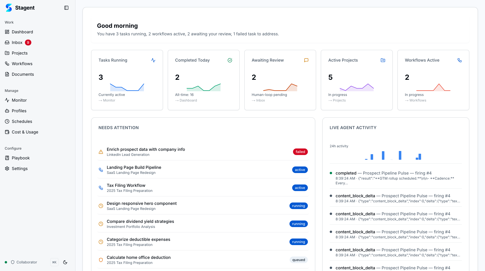
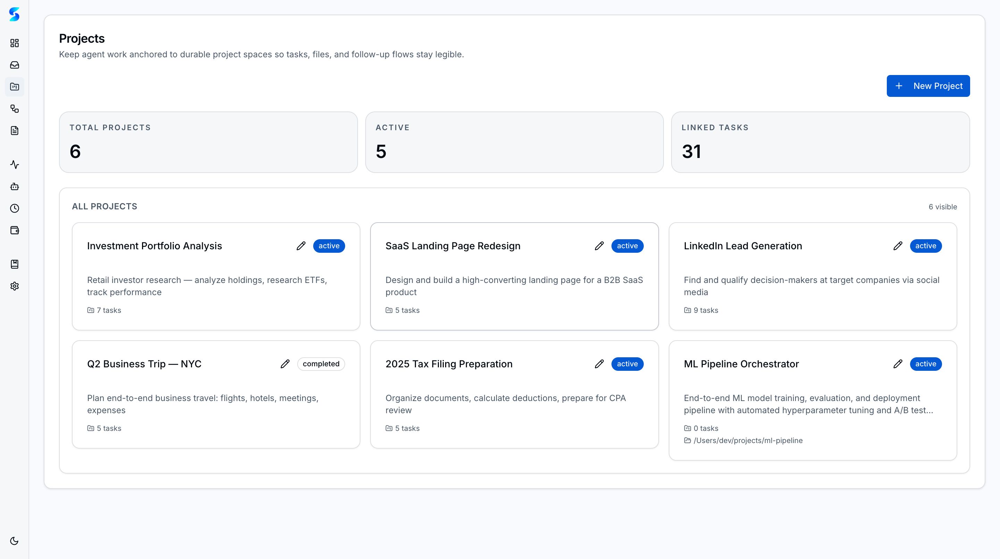
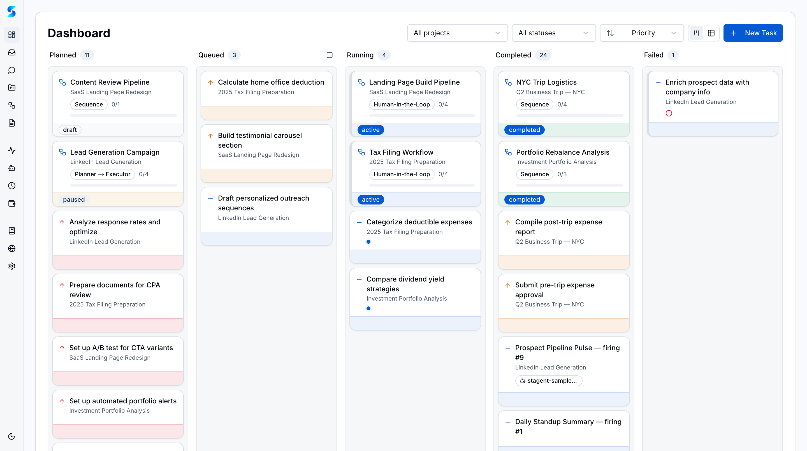
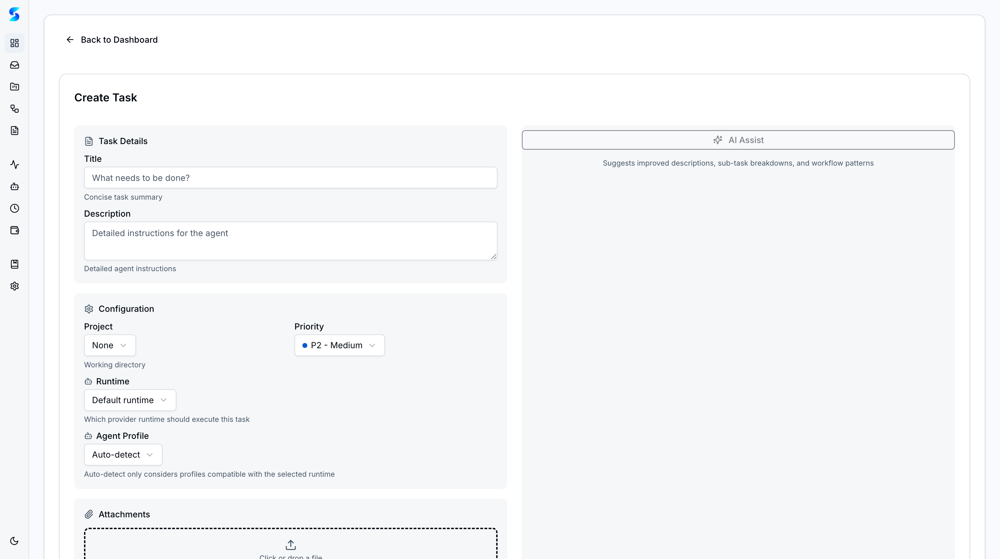
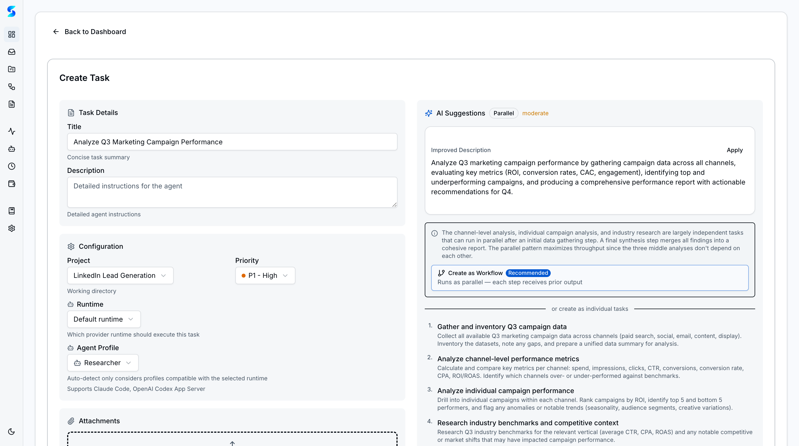

# Personal Use Guide

You are a solo user — maybe a freelancer, a student, or someone who just wants an AI assistant that actually stays organized. You have heard about AI agents but never had a workspace that lets you govern what they do, track what they produce, and keep everything in one place. Stagent is that workspace. In the next twenty minutes you will install Stagent, create your first project, delegate your first task to an AI agent, and learn how to use the home workspace as your daily command center.

## Prerequisites

- **Node.js 18 or later** installed on your machine
- A terminal application (Terminal on macOS, PowerShell or WSL on Windows)
- An Anthropic API key or Claude Max subscription for agent execution
- About 20 minutes of uninterrupted time

## Journey Steps

### Step 1 — Install and Launch Stagent
*Estimated time: 2 minutes*

Every journey begins with a single command. Open your terminal and run:

```bash
npx stagent
```

Stagent installs its dependencies, initializes a local SQLite database at `~/.stagent/stagent.db`, and opens your browser to `http://localhost:3000`. There is no account to create, no cloud service to configure. Everything runs on your machine, and your data stays on your machine.

> **Tip**: If port 3000 is already in use, Stagent will automatically find the next available port and tell you in the terminal output.

---

### Step 2 — Explore the Home Workspace
*Estimated time: 2 minutes*

The first screen you see is the Home workspace — your daily briefing surface. It shows a compact summary of everything happening across your projects: active tasks, recent agent activity, pending approvals, and upcoming schedules.



Take a moment to scan the layout. The left sidebar is your navigation hub — it lists every major section of Stagent: Dashboard, Inbox, Monitor, Projects, Workflows, Documents, Profiles, Schedules, Cost & Usage, Playbook, and Settings. The home view itself is organized into cards that surface the most important information without requiring you to click into each section.

> **Tip**: The home workspace is not just a landing page. Think of it as your morning standup — glance at it when you start your day to see what needs attention.

---

### Step 3 — Create Your First Project
*Estimated time: 2 minutes*

Before you can create tasks, you need a project to hold them. Click **Projects** in the sidebar. You will see the projects list — currently empty if this is a fresh install.

Click the **New Project** button. Give your project a name like "Personal Website Redesign" or "Research Notes." Add a short description that reminds you what this project is about. If you want the AI agent to work with files on your machine, set a **Working Directory** — this tells the agent where to read and write files.



Click **Create** and your project appears in the list. Projects in Stagent are containers — they group tasks, documents, and workflows together so that your work stays organized as it grows.

> **Tip**: The working directory is powerful. If you point it at a code repository, the agent can read your codebase, edit files, and run commands — all governed by the permissions you set in Settings.

---

### Step 4 — Navigate to the Dashboard
*Estimated time: 1 minute*

Click **Dashboard** in the sidebar. The dashboard is a kanban board that shows all your tasks organized by status: Planned, In Progress, Completed, and Failed. Right now it is empty — you are about to change that.



The dashboard supports multiple views. You can filter by project, by priority, by agent profile, or by status. For now, the default view showing all tasks is exactly what you need.

---

### Step 5 — Create Your First Task
*Estimated time: 2 minutes*

Click the **Create Task** button in the top right corner of the dashboard. A form opens with fields for the task title, description, project assignment, priority, and complexity.



Start by typing a clear, specific title. Instead of "Write something," try "Draft a 500-word introduction for my personal website that highlights my background in data science." The more specific your prompt, the better the agent will perform.

Select your project from the dropdown. Set the priority to **Medium** and the complexity to **Low** — this is a straightforward writing task. You can leave the agent profile as the default General profile for now.

> **Tip**: Think of the task title as the instruction you would give a capable colleague. Be specific about what you want, how long it should be, and what tone to use.

---

### Step 6 — Use AI Assist to Refine Your Task
*Estimated time: 2 minutes*

Before you submit, notice the **AI Assist** button on the form. This is one of Stagent's most useful features for beginners. Click it and watch what happens.



AI Assist analyzes your task title and generates a detailed description, suggests an appropriate complexity level, recommends a priority, and even proposes which agent profile would be best suited for the job. It turns your one-line instruction into a well-structured task specification.

Review the suggestions. You can accept them wholesale, edit individual fields, or dismiss suggestions you disagree with. AI Assist is a collaborator, not a dictator — you always have the final say.

---

### Step 7 — View Your Task on the Board
*Estimated time: 2 minutes*

Click **Create Task** to submit. Your task appears on the dashboard kanban board in the **Planned** column. From here you have two choices: run the task manually by clicking into it and hitting **Execute**, or let it sit in the queue for a scheduled run.

For your first task, click into it and hit **Execute**. The task card moves to the **In Progress** column and the agent begins working. You can watch the execution in real-time by clicking through to the Monitor view, but for now, stay on the dashboard and watch the status update.

When the agent finishes, the card moves to **Completed**. Click into the task to see the full output — the agent's response, any files it created or modified, and a log of every tool it used during execution.

> **Tip**: If the agent needs to use a tool you have not approved yet (like writing to the filesystem), it will pause and send a notification to your Inbox. More on that in the next step.

---

### Step 8 — Check Your Inbox for Notifications
*Estimated time: 2 minutes*

Click **Inbox** in the sidebar. The inbox is where Stagent surfaces anything that needs your attention: tool approval requests, agent questions, batch proposals, and status change notifications.

If your agent needed permission to use a tool during execution, you will see an approval request here. You can approve, deny, or approve with an "Always Allow" flag that remembers your preference for future runs. This is the "human-in-the-loop" governance that makes Stagent different from running an AI agent in a bare terminal.

> **Tip**: The inbox is also where learned context proposals appear. As the agent works, it discovers patterns and preferences. It proposes these as "learned context" entries that you can accept or reject — teaching the agent to work better for you over time.

---

### Step 9 — Return to the Home Workspace
*Estimated time: 2 minutes*

Click the Stagent logo or **Home** in the sidebar to return to the home workspace. Notice how it has changed — it now shows your active project, your completed task, and a summary of recent agent activity. The home workspace updates dynamically as your work progresses.

This is your daily starting point. Each morning, open Stagent, glance at the home workspace, and you will know exactly what happened overnight (if you have scheduled tasks running), what needs your attention, and what is coming up next.

---

### Step 10 — Next Steps
*Estimated time: 1 minute*

You have completed the essentials: installing Stagent, creating a project, delegating a task with AI Assist, and navigating the core workspace. Here is where to go from here:

- **Add more tasks** to your project — try different types like research, code generation, or document writing
- **Explore Documents** — upload reference files that your agent can use as context during task execution
- **Set up a Schedule** — automate recurring tasks like daily summaries or weekly reports
- **Browse Profiles** — discover specialized agent personas beyond the default General profile

## What's Next

- [Work Use Guide](./work-use.md) — organize projects, manage documents, schedule automations, and control costs
- [Power User Guide](./power-user.md) — custom profiles, multi-step workflows, and autonomous loops
- [Developer Guide](./developer.md) — technical setup, runtime configuration, and extending Stagent

---

*You have taken your first steps with governed AI. The agent works for you, within the boundaries you set, and everything it does is logged, reviewable, and reversible. Welcome to Stagent.*
