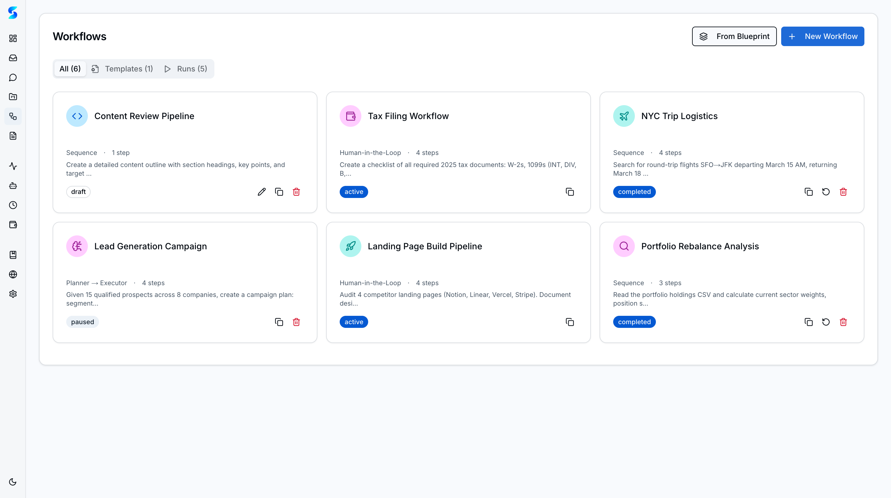
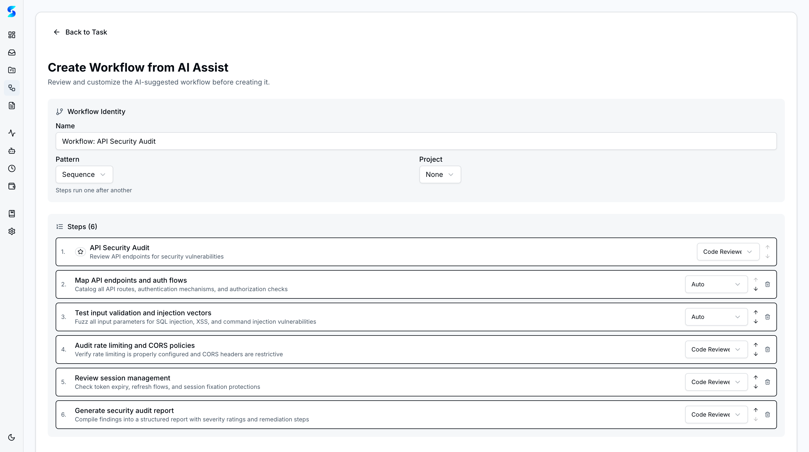

# Power User Guide

You have run dozens of tasks, built several projects, and learned the rhythms of governed AI. Now you want to push further. You want agents that behave exactly the way you specify, multi-step workflows that chain operations together, blueprint templates you can reuse across projects, parallel research that fans out to multiple agents simultaneously, and autonomous loops that iterate until a goal is met. This guide covers the advanced orchestration layer that makes Stagent a true agent workspace rather than a simple chat interface.

## Prerequisites

- Familiarity with basic Stagent operations (see [Personal Use Guide](./personal-use.md))
- At least one project with completed tasks
- A configured AI provider (Claude, OpenAI Codex, or both for cross-provider workflows)
- Comfort with writing detailed agent instructions

## Journey Steps

### Step 1 — Browse the Agent Profile Catalog
*Estimated time: 2 minutes*

Stagent ships with 13+ built-in agent profiles, each designed for a specific type of work. Before creating custom profiles, understand what is already available.


Navigate to **Profiles** in the sidebar. The catalog displays each profile as a card with a colored icon circle (blue for work, purple for personal), its name, description, and capability tags. The built-in profiles include:

- **General** — a balanced all-rounder for most tasks
- **Code Reviewer** — security and quality analysis with OWASP awareness
- **Researcher** — deep investigation with citation tracking
- **Document Writer** — structured output with format control

Browse the catalog and read the descriptions. Each profile defines the agent's personality, allowed tools, response style, and behavioral constraints. Understanding these will help you decide when to use a built-in profile and when to create your own.

> **Tip**: Profiles are not just prompts. They control tool access, max turn count, and behavioral rules. A Code Reviewer profile restricts the agent to read-only tools, while a Document Writer profile grants write access for generating output files.

---

### Step 2 — Create a Custom Profile
*Estimated time: 2 minutes*

Built-in profiles cover common cases. Custom profiles let you encode your exact requirements.

Click **New Profile** in the Profiles view. Build a specialist:

1. **Name**: "TypeScript Migration Specialist"
2. **Description**: "Migrates JavaScript codebases to TypeScript with strict type safety"
3. **Instructions**: Write detailed behavioral rules:
   ```
   You are an expert at migrating JavaScript codebases to TypeScript.
   - Always use strict TypeScript configuration (no `any` types)
   - Preserve existing test coverage; update test imports after migration
   - Check for circular dependencies before modifying module structure
   - Report a migration progress percentage after each file conversion
   ```
4. **Allowed Tools**: Grant file read, file write, glob, grep, and bash
5. **Max Turns**: Set to 50 (migrations require many iterations)

Click **Create** and your custom profile appears in the catalog alongside the built-in ones.

> **Tip**: Good profile instructions include both goals ("migrate to TypeScript") and constraints ("no `any` types"). Constraints are what differentiate a mediocre agent from a reliable one.

---

### Step 3 — Test Profile Behavior
*Estimated time: 2 minutes*

Before deploying a custom profile on real work, verify it behaves as expected.

Open your new profile's detail view and click **Run Test**. Stagent sends a series of sample prompts to the profile and shows you how the agent responds. Check for:

- Does the agent follow your instructions faithfully?
- Does it respect the tool restrictions you set?
- Does it produce output in the format you expect?
- Does it handle edge cases gracefully?

If the behavior is off, edit the instructions and test again. Iteration is normal — even a few rounds of refinement can dramatically improve output quality. Think of profile creation as training a new team member: you give instructions, observe behavior, and provide corrections.

---

### Step 4 — Build a Sequence Workflow
*Estimated time: 2 minutes*

Workflows chain multiple tasks together. A sequence workflow runs steps one after another, with each step receiving the previous step's output as context.

Navigate to **Workflows** in the sidebar and click **New Workflow**.



Select the **Sequence** pattern and add your steps:

1. **Step 1 — Research**: "Analyze the current codebase and identify all JavaScript files that should be migrated to TypeScript. Prioritize by import frequency." Assign the Researcher profile.
2. **Step 2 — Migrate**: "Using the prioritized list from the previous step, migrate the top 5 files to TypeScript." Assign your custom TypeScript Migration Specialist profile.
3. **Step 3 — Review**: "Review the migrated files for type safety, check that tests still pass, and report any issues." Assign the Code Reviewer profile.

Click **Create Workflow**. Each step inherits the project's working directory and has access to previous step outputs.

---

### Step 5 — Use a Blueprint Template
*Estimated time: 2 minutes*

Blueprints are pre-configured workflow templates. Instead of building from scratch every time, start from a proven pattern.

Click **New Workflow** and select the **Blueprints** tab. Browse the available templates — "Code Review Pipeline," "Research Report," "Documentation Sprint," and others. Each blueprint shows:

- The workflow pattern (sequence, parallel, checkpoint)
- The number of steps and their descriptions
- Which variables you need to fill in (repository path, review criteria, output format)

Select a blueprint, fill in the dynamic form with your specific values, review the generated steps, and click **Create Workflow**. The blueprint becomes a fully editable workflow that you can customize further.



> **Tip**: Blueprints track lineage. You can always see which template a workflow came from and how it was customized, making it easy to iterate on proven patterns.

---

### Step 6 — Configure a Parallel Research Workflow
*Estimated time: 2 minutes*

Some tasks benefit from multiple agents working simultaneously on different facets of the same problem. The parallel pattern fans out to 2-5 branches, then synthesizes results.

Create a new workflow with the **Parallel** pattern:

- **Branch 1**: "Research competitive pricing models in the SaaS market for developer tools"
- **Branch 2**: "Analyze our current pricing structure and identify gaps"
- **Branch 3**: "Survey recent industry reports on developer tool adoption trends"
- **Synthesis step**: "Combine the three research outputs into a unified pricing strategy recommendation with supporting evidence"

Assign the Researcher profile to all branches and the Document Writer profile to the synthesis step. When executed, all three branches run concurrently, and the synthesis step waits for all of them to complete before combining their outputs.

---

### Step 7 — Set Up a Swarm Workflow
*Estimated time: 2 minutes*

The swarm pattern is Stagent's most sophisticated orchestration model. A **mayor** agent plans the work, **worker** agents execute in parallel, and a **refinery** agent synthesizes the results.

Create a new workflow with the **Swarm** pattern:

1. **Mayor prompt**: "Break down the following goal into 3-4 independent subtasks: Audit the entire authentication module for security vulnerabilities, performance bottlenecks, and code quality issues."
2. **Worker concurrency**: Set to 3
3. **Refinery prompt**: "Synthesize the worker outputs into a single audit report with severity rankings, recommended fixes, and estimated effort for each issue."
4. **Profile assignments**: Use Code Reviewer for workers and Document Writer for refinery

The mayor decomposes the goal, workers execute their assigned subtasks in parallel, and the refinery combines everything into a coherent deliverable.

---

### Step 8 — Monitor Workflow Execution
*Estimated time: 2 minutes*

Multi-step workflows generate a lot of activity. The Monitor is where you watch it unfold.


Navigate to **Monitor** while a workflow is running. You will see:

- **Step-level progress**: Which steps are pending, running, completed, or failed
- **Tool calls**: Every file read, command execution, and API call the agents make
- **Reasoning entries**: The agent's decision-making process, visible in real time
- **Error highlights**: Failed operations displayed with red status indicators

For checkpoint workflows, the Monitor will show pause points where the workflow is waiting for your approval. Click through to approve or reject before the next step begins.

> **Tip**: If a step fails, you can retry just that step without restarting the entire workflow. This saves time and tokens on long-running orchestrations.

---

### Step 9 — Review Learned Context Proposals
*Estimated time: 2 minutes*

After workflows complete, agents often propose behavioral improvements — patterns they discovered during execution that could make future runs more effective.

Check your **Inbox** after a workflow finishes. Learned context proposals arrive in batches for workflow runs, so you can review them all at once. Each proposal describes a rule like:

- "This codebase uses path aliases (`@/lib/...`) instead of relative imports"
- "Test files are co-located in `__tests__/` subdirectories, not in a top-level test folder"
- "The team prefers functional components over class components"

**Accept** proposals that capture genuine patterns. **Edit** proposals that are directionally correct but need refinement. **Reject** proposals that are too specific or incorrect. Accepted proposals become permanent context for future tasks in the same project.

---

### Step 10 — Schedule Autonomous Runs
*Estimated time: 2 minutes*

Combine workflows with schedules to create fully autonomous pipelines.


Navigate to **Schedules** and click **New Schedule**. Instead of a simple prompt, you can link a schedule to a workflow:

1. **Name**: "Weekly Code Quality Pipeline"
2. **Linked Workflow**: Select your sequence workflow from Step 4
3. **Interval**: `7d` or `0 9 * * 1` (Monday mornings at 9am)
4. **Max Firings**: 12 (three months of weekly runs)
5. **Stop Conditions**: Configure iteration limits, time budgets, or quality thresholds

The schedule fires the entire workflow automatically, creating child tasks for each step. Results accumulate on the Dashboard, and you review them at your convenience.

> **Tip**: Autonomous loops support four stop conditions: max iterations, time budget, token budget, and custom quality checks. Use multiple conditions together for safety — the loop stops when any condition is met.

---

### Step 11 — Stream Live Logs
*Estimated time: 2 minutes*

For real-time visibility into running tasks, use the Monitor's live streaming mode.

Navigate to **Monitor** and filter by a specific task or workflow. The SSE (Server-Sent Events) stream delivers log entries as they happen — tool calls, agent reasoning, file modifications, and status changes appear with sub-second latency.

This is especially valuable for long-running autonomous loops where you want to observe the agent's iterative progress without waiting for the full run to complete. You can spot issues early, pause execution if something goes wrong, and resume once the problem is fixed.

---

### Step 12 — Next Steps
*Estimated time: 1 minute*

You now have access to Stagent's full orchestration toolkit: custom profiles, multi-step workflows, blueprint templates, parallel research, swarm patterns, and scheduled autonomous runs. Here is where to go deeper:

- **Create blueprints from successful workflows** — save your best patterns as reusable templates
- **Experiment with cross-provider workflows** — assign different providers to different steps (Claude for research, Codex for code generation)
- **Build a profile library** — create specialist profiles for every type of work your team does
- **Combine swarm and schedule patterns** — run complex multi-agent orchestrations on a recurring cadence

## What's Next

- [Developer Guide](./developer.md) — CLI setup, runtime configuration, API integration, and extending Stagent
- [Work Use Guide](./work-use.md) — document management, cost control, and approval workflows
- [Personal Use Guide](./personal-use.md) — revisit the fundamentals

---

*You are no longer just using AI agents — you are orchestrating them. Custom profiles define how they think, workflows define how they collaborate, and schedules define when they act. The workspace is yours to design.*
