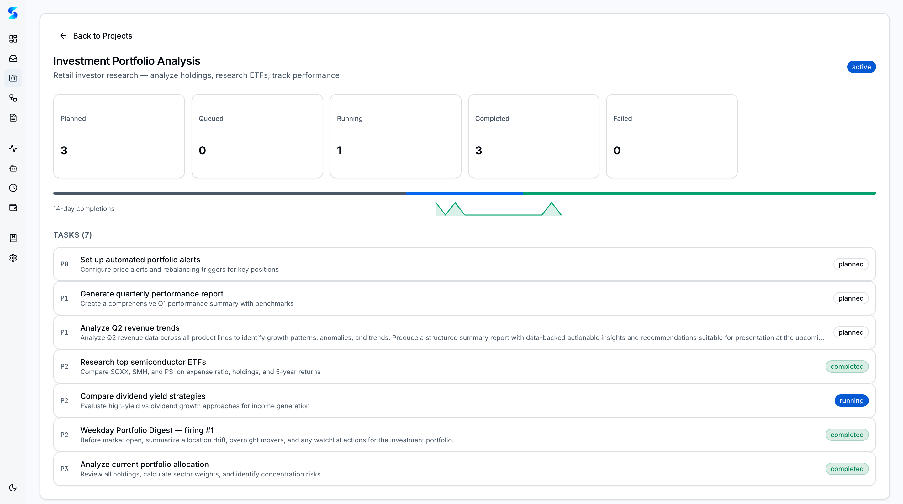
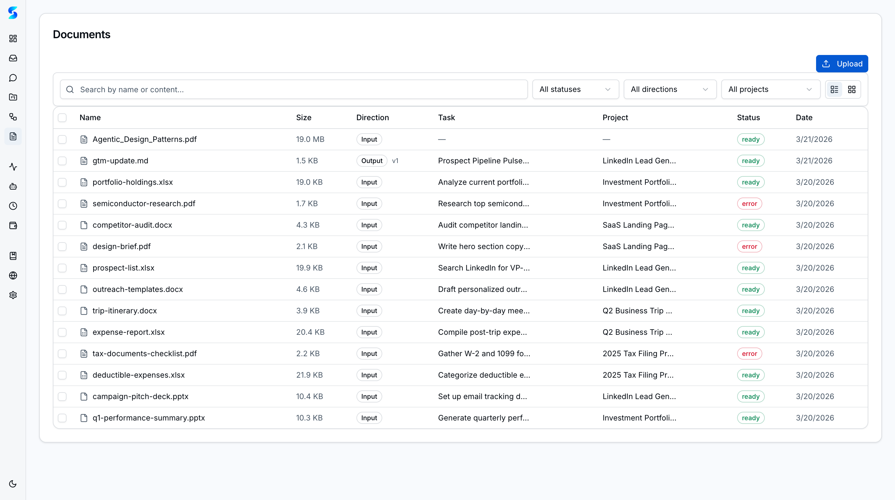
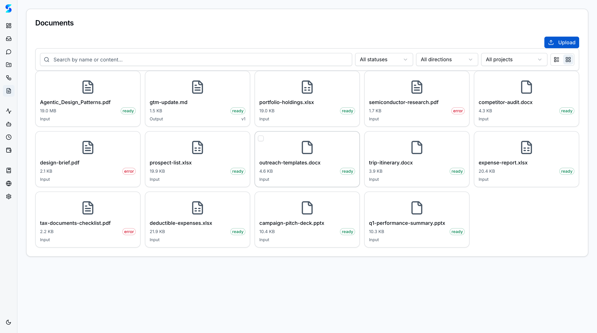
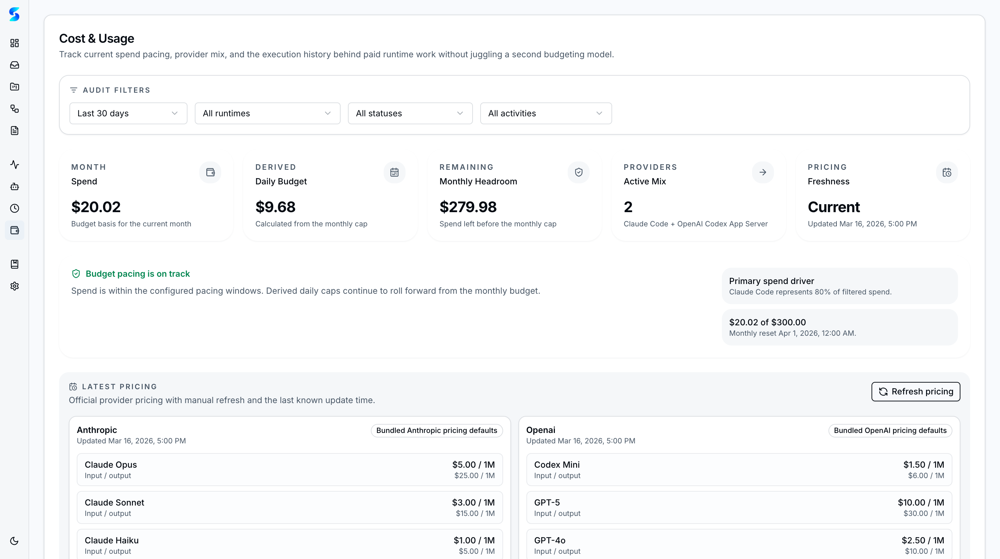
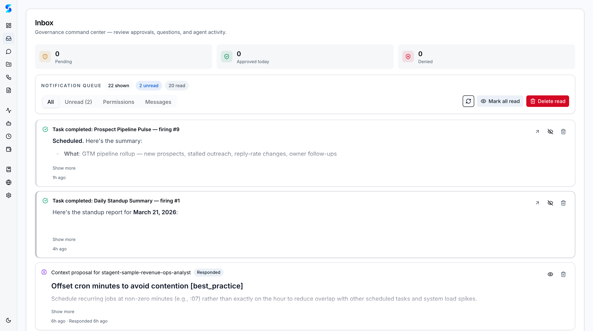

# Work Use Guide

You are a team lead or operations-minded professional who needs more than a simple task runner. Your work involves multiple projects running in parallel, reference documents that agents need to understand, recurring tasks that should happen on a schedule, budgets that cannot be exceeded, and approval gates that keep humans in control. Stagent handles all of this. In the next twenty-four minutes you will set up a work project with document context, configure scheduled automations, establish cost guardrails, and learn the approval workflow that keeps everything governed.

## Prerequisites

- Stagent running at `localhost:3000` (run `npx stagent` to start)
- An AI provider configured in Settings (Anthropic API key or Claude Max OAuth)
- Familiarity with basic Stagent navigation (see [Personal Use Guide](./personal-use.md))
- Reference documents ready to upload (PDFs, Word docs, spreadsheets, or plain text)

## Journey Steps

### Step 1 — Create a Work Project with a Working Directory
*Estimated time: 2 minutes*

Work projects are different from personal experiments. They need structure, and they need a connection to your actual codebase or file system.

Navigate to **Projects** in the sidebar and click **New Project**. Name it something meaningful like "Q2 API Migration" or "Client Onboarding Automation." Write a description that captures the project's goal — agents will see this description as context when working on tasks within the project.

Set the **Working Directory** to the relevant folder on your machine. For a code project, point it at the repository root. For a documentation project, point it at the folder where output files should land. The working directory is the agent's home base — it determines where file operations happen.

> **Tip**: Every task within this project inherits the working directory. You do not need to specify file paths in every task prompt — the agent already knows where to look.

---

### Step 2 — Upload Reference Documents
*Estimated time: 2 minutes*

Agents work better with context. Instead of pasting long specifications into task prompts, upload them as documents and let Stagent handle the rest.

Navigate to **Documents** in the sidebar. Click **Upload** and select your reference files — API specifications, design documents, compliance checklists, meeting notes, or anything the agent might need to reference.

Stagent automatically processes each upload: it extracts text from PDFs, parses Word documents, reads spreadsheets, and measures image dimensions. The extracted content becomes searchable and injectable into agent prompts. Assign each document to the appropriate project using the project dropdown.

> **Tip**: You can upload multiple files at once. Stagent supports PDF, Word (.docx), Excel (.xlsx), PowerPoint (.pptx), plain text, images, and more.

---

### Step 3 — Browse Documents in Grid View
*Estimated time: 2 minutes*

Switch to the grid view to see your document library visually.

The grid view displays document cards with type icons, file sizes, and processing status indicators. Click any card to open the document detail sheet, where you can see the extracted text, edit metadata, or reassign the document to a different project.

For large libraries, use the search bar to filter by name or type. You can also bulk-select documents for batch operations like deletion or project reassignment.

---

### Step 4 — Link Documents to Tasks
*Estimated time: 2 minutes*

Now create a task that leverages your uploaded documents.

Navigate to the **Dashboard** and click **Create Task**. Title it something like "Review the API specification and identify all breaking changes from v2 to v3." In the document attachment section, link the relevant API spec you uploaded earlier.

When the agent executes this task, the document's extracted text is automatically injected into the agent's context window. The agent can reference specific sections, quote passages, and build its analysis on your actual documentation — not hallucinated assumptions.

Choose the **Code Reviewer** profile for analytical tasks like this, or the **Researcher** profile for broader investigation work.

---

### Step 5 — Set Up a Recurring Schedule
*Estimated time: 2 minutes*

Some tasks should run without you clicking Execute every time. Schedules automate this.

Navigate to **Schedules** in the sidebar and click **New Schedule**. Configure it:

1. **Name**: "Daily Dependency Audit"
2. **Prompt**: "Check all npm dependencies for known vulnerabilities and outdated versions. Report findings as a prioritized list."
3. **Interval**: Enter `1d` for daily, `12h` for twice daily, or use cron syntax like `0 9 * * 1-5` for weekday mornings at 9am
4. **Project**: Select your work project
5. **Profile**: Choose the most appropriate agent profile
6. **Max Firings**: Set a limit like 30 to cap the total number of runs

Click **Create** and the schedule becomes active immediately. Each firing creates a child task on the Dashboard, so all results flow through the same kanban board you already use.

> **Tip**: You can pause and resume schedules without deleting them. Useful during holidays or project freezes.

---

### Step 6 — Configure Budget Guardrails
*Estimated time: 2 minutes*

Running agents costs tokens, and tokens cost money. Before scaling up your automations, set spending limits.

Navigate to **Settings** and find the budget configuration section. You can set:

- **Global budget**: A monthly ceiling across all projects
- **Per-project budgets**: Different limits for different workstreams
- **Warning threshold**: Get notified when spending reaches a percentage of the limit
- **Enforcement mode**: Choose between **warn** (notification only) or **block** (halt execution when limit is reached)

Start with a conservative global limit and adjust as you learn your usage patterns. The Cost & Usage dashboard will help you calibrate.

---

### Step 7 — Monitor Spending
*Estimated time: 2 minutes*

Navigate to **Cost & Usage** in the sidebar to see where your budget is going.

The dashboard breaks down spending by:

- **Provider**: How much is going to Claude vs. OpenAI Codex
- **Project**: Which projects are most expensive
- **Time period**: Daily, weekly, and monthly trends
- **Token type**: Input tokens vs. output tokens (output is typically more expensive)

Use this data to optimize. If a research task is burning through tokens, consider giving it a more focused prompt. If one project dominates spending, it might need a tighter per-project budget or a less expensive agent profile.

> **Tip**: Scheduled tasks can silently accumulate costs. Check Cost & Usage weekly to make sure no schedule is running away with your budget.

---

### Step 8 — Handle Inbox Approvals
*Estimated time: 2 minutes*

With multiple projects and schedules running, your Inbox becomes the control center for human oversight.

Navigate to **Inbox** to see pending items. Each notification card tells you:

- **What** the agent wants to do (e.g., run a shell command, write a file)
- **Why** it needs permission (the tool name and arguments)
- **Which task** triggered the request
- **When** the request was made

You have three response options:

1. **Allow Once** — approve this specific request only
2. **Always Allow** — save the pattern so future identical requests auto-approve
3. **Deny** — reject the request; the agent will try an alternative approach or report the limitation

---

### Step 9 — Review Batch Proposals
*Estimated time: 2 minutes*

After workflows or multi-task runs complete, the agent often proposes **learned context** — behavioral patterns it discovered that could improve future performance.

These proposals arrive in your Inbox as a batch. Each one describes a rule the agent wants to remember, such as "This codebase uses Drizzle ORM instead of raw SQL" or "The client prefers bullet-point summaries over prose paragraphs."

Review each proposal carefully:

- **Accept** proposals that capture genuine patterns you want the agent to follow
- **Edit** proposals that are directionally correct but need refinement
- **Reject** proposals that are too specific, incorrect, or not useful

Accepted proposals become part of the agent's context for future tasks in the same project, making it progressively smarter about your work.

---

### Step 10 — Check Project Health
*Estimated time: 2 minutes*

Return to the project detail view to see how your work project is progressing.

Click your project in the **Projects** list. The detail view shows:

- **Task breakdown by status**: How many tasks are planned, in progress, completed, or failed
- **Completion percentage**: A progress indicator across all tasks
- **Activity sparkline**: A 14-day trend of task activity
- **Recent tasks**: The latest tasks with their statuses and assigned profiles

This is your project-level health check. If completion rates are low or failure rates are high, investigate the failing tasks in Monitor to understand what went wrong.

---

### Step 11 — Track Costs by Provider
*Estimated time: 2 minutes*

If you use both Claude and OpenAI Codex, understanding per-provider costs helps you make routing decisions.

Return to **Cost & Usage** and examine the provider breakdown. Claude and Codex have different pricing models and different strengths. You might discover that:

- Research tasks are cheaper on one provider
- Code generation tasks are faster on another
- Some profiles work better with specific providers

Use these insights to assign profiles and providers strategically across your projects, balancing cost against quality.

---

### Step 12 — Next Steps
*Estimated time: 1 minute*

You have set up a complete work environment: projects with document context, scheduled automations, cost guardrails, and an approval workflow that keeps you in control. Here is where to go deeper:

- **Create more schedules** — automate weekly reports, daily standups, or periodic audits
- **Upload more documents** — build a reference library that agents can draw from
- **Explore bulk operations** — select multiple tasks on the Dashboard for batch status changes
- **Set up per-project budgets** — give high-value projects more runway while constraining experiments

## What's Next

- [Power User Guide](./power-user.md) — custom profiles, workflow blueprints, autonomous loops, and swarm orchestration
- [Developer Guide](./developer.md) — runtime configuration, API integration, CLI usage, and extending Stagent
- [Personal Use Guide](./personal-use.md) — revisit the basics if you need a refresher on core concepts

---

*Your workspace is now operational. Documents provide context, schedules provide consistency, budgets provide safety, and approvals provide governance. The agents work within the system you have built.*
